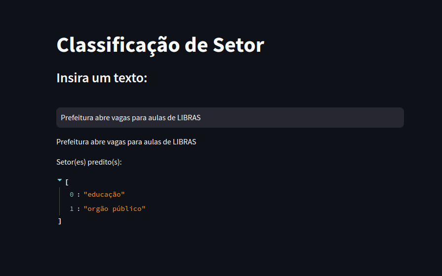

# sectors




## Este é um projeto de Processamento de Linguagem Natural onde o interesse é, dado um texto de input, predizer se ele é referente à um ou mais setores dentre 5. 

**Os 5 setores são:**

```
1. Educação
2. Finanças
3. Indústrias
4. Órgão Público
5. Varejo
```

O Texto pode se enquadrar em um ou mais setores, como no exemplo "Prefeitura abre vagas para aulas de LIBRAS" onde o texto pode ser classificado em Órgão Público e Educação.

## Resumo:

O dataset utilizado possui a variável 'sentence' referente aos textos e a variável 'category' referente aos setores de interesse. Os textos estão disponíveis em português com as respectivas acentuações das palavras, com isso foi necessário realizar todo o pre processamento, que envolve desde a remoção de caracteres especiais até o padding (vide `analysis.ipynb`). Para o problema de multi label, foi decidido criar uma arquitetura de Rede Convolucional para as labels binarizadas, ou seja, foi utilizado a função de ativação sigmóide na última camada densa, onde o peso entre 0 e 1 atribuído à cada classe é comparado à um threshold. Se uma ou mais classe ultrapassar esse threshold, o output será de que o texto é referente à esses setores. 

Para mais informações sobre a abordagem [Large-scale multi-label text classification](https://keras.io/examples/nlp/multi_label_classification/)    

## Dataset:
  
- O dataset consiste em uma coluna `sentence`, referente aos textos a serem analisados, e a coluna `category` que contém os setores para o respectivo texto, podendo ser apenas um ou mais setores.

## Conteúdo:

...
