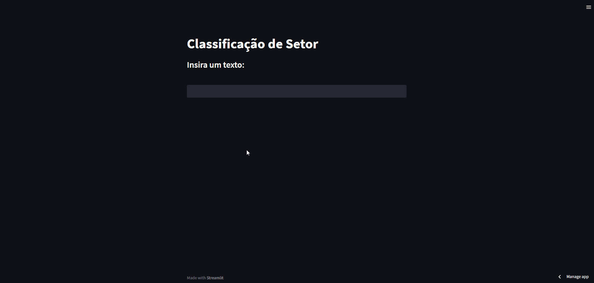

# Natural Language Processing for Texts by Sectors




### [Click here](https://sectors-nlp.streamlit.app/) to classify which sector your text belongs to.

## This is a Natural Language Processing project where the goal is to predict which sector(s) a given input text belongs to, from a set of 5 sectors.

**The 5 sectors are:**

```
1. Educação
2. Finanças
3. Indústrias
4. Órgão Público
5. Varejo
```

The text can belong to one or more sectors, such as in the example "Prefeitura abre vagas para aulas de LIBRAS" where the text can be classified into both "Órgão Público" and "Educação". (Eng: 'City Hall opens vacancies for LIBRAS classes' -> 'Public Sector' and 'Education'.) 

## Summary:

The dataset used contains the variable 'sentence', which refers to the texts, and the variable 'category', which refers to the sectors of interest. The texts are in Portuguese with the proper word accents, so extensive preprocessing was required. This involved removing special characters and applying padding (see `analysis.ipynb`). 

For the multi-label problem, a Convolutional Neural Network (CNN) architecture was created for the binarized labels. In other words, the sigmoid activation function was used in the last dense layer, and the weight between 0 and 1 assigned to each class is compared to a threshold. If one or more classes exceed this threshold, the output will indicate that the text belongs to those sectors.

For more information on this approach, visit [Large-scale multi-label text classification](https://keras.io/examples/nlp/multi_label_classification/)    

## Dataset:
  
- The dataset consists of a `sentence` column, which contains the texts to be analyzed, and a `category` column, which contains the sectors for the respective text, potentially belonging to one or more sectors.

## Contents:

**The repository contains the following files:**
- `analysis.ipynb` - > This notebook contains the entire pipeline for solving the project, executed step by step.
- `NLPPipeline.py` -> This file builds a class to run the NLP Pipeline (you can pass your own dataset).
- `run_pipeline.py` -> This file demonstrates the usage of the `NLPPipeline` class.
- `PredictText.py` -> This file performs classification based on an input text.
- `NLPStreamlit.py` -> This file creates a simple Streamlit application where the user inputs a sentence, and the text's class(es) are returned.
- `model_tensorflowjs` -> This folder contains the model converted to JavaScript (done using TensorFlow.js).
- `CNN_MultiLabel_NLP.h5` -> This is the serialized model, useful for loading it if you don’t want to train it again.
- `dataset` -> This folder contains the dataset used for the project.
- `images` -> This folder stores project images.
- `requirements.txt` -> Dependencies.

## Usage:

**Initial steps**
1. Clone this repository to your computer by running the following command in the terminal:
   ```
   git clone https://github.com/MatheussAlvess/NLP_Sectors.git
   ```
2. Navigate to the project directory.
3. Ensure the required dependencies are installed by running in the terminal:
    ```
    pip install -r requirements.txt
    ```
   
- **To classify a text, run the following command in the terminal:**

  ```
  python PredictText.py <your_text_here>
  ```
 This will return the sector(s) that the given text belongs to.
  
  > Example: Running `python PredictText.py Estudar LIBRAS` will return `educação`, concluding that the input text belongs to the Education sector.

## To convert your trained model (TensorFlow/Keras) to JavaScript, follow these steps:
1. Install TensorFlow.js by running the following command in the terminal:
   ```
   pip install tensorflowjs
   ``` 
2. With TensorFlow.js installed, run the following command in the terminal:
   ```
   tensorflowjs_converter --input_format==keras model_saved/CNN_MultiLabel_NLP.h5 model_converted/ 
   ```
This will convert your model.

> [!TIP]
> You can save the model directly in your code after training.
> 
>  ```
>  Example:
>  
>  model = DCNN(vocab_size=2000)  
>  ...
>  model.compile(...)
>  model.fit(...)
>  tfjs.converters.save_keras_model(model, 'model_converted/')
>  ```
>
> If you encounter `Exception: Error dumping weights, duplicate weight name kernel`, add the following command before conversion:
> ```python
> #command  
> for layer in model.layers:
>     for weight in layer.weights:
>         weight.name = layer.name + '/' + weight.name
> #converting
> tfjs.converters.save_keras_model(model, 'model_converted/')
> ```
  

___________________________________________
## To use the pipeline as the base for your own project, follow these steps:

**Once everything is ready to run (repository cloned):**

1. Store your dataset in `.csv` format within a folder.
Example: `path_data_setimentos/dataset_sentimentos.csv`

3. Inside the `run_pipeline.py` file, modify the parameters dictionary, passing the directories, names, and model parameters as needed.
 Example:
  ```
  params = {
    'dataset_path': 'path_data_setimentos/',
    'dataset_name': 'dataset_sentimentos.csv',
    'sentences_variable': 'tweets',
    'categories_variable': 'sentimentos',
    'model_name': 'CNN_model_sentimentos.keras',
    'save': True, # necessary for the model to be saved
    'emb_dim': 128,
    'nb_filters': 100,
    'ffn_units': 512,
    'nb_classes': 5,
    'batch_size': 32,
    'dropout_rate': 0.2,
    'nb_epochs': 100,
    'verbose': 1}
  ```

3. Once all parameters are set, run the following command in the terminal:
   ```
   python run_pipeline.py
   ```
   After execution, the model will be saved with the specified name in the `params` dictionary. With the saved model, you can classify input texts.

4. Now you can use the `PredictText.py` file (be sure to update the model name within the file).

___________________________________________

# Explaining the Project Solution:

**1. The first step was deciding which approach to use.**
- Choosing the multi-label classification approach, it was decided to create a Convolutional Neural Network (CNN) architecture.
- For the model, the use of the sigmoid activation function in the output layer was chosen, as the labels would be represented by a binary encoding.

**2. Exploratory Data Analysis.**
- After deciding on the modeling, exploratory data analysis was done (this step was kept simple and efficient for brevity).
- From the analysis, it was understood that the input texts were sentences in Portuguese with accents, numbers, and special characters.

**3. Data Preprocessing.**
- With this in mind, data preprocessing started. The first step was removing accents and special characters, done using Python functions (Regular Expression and String).
- Then, stopwords were removed to reduce the input dimensionality for the model. (Note: Lemmatization, normalization, special tokens, etc., were not considered in this project version.)

**4. Data Preparation.**
- Given the preprocessing done, the next step was converting the characters to numbers.
- In this step, text tokenization was done using the TensorFlow/Keras library (which already includes a simplistic approach to text handling).
- After tokenization, padding was applied to ensure all inputs had the same length (again using TensorFlow/Keras).

At this point, the data was ready to be fed into the model. However, it was necessary to create the model and split the training and testing datasets.

**5. Splitting the Training and Testing Datasets.**
- Before splitting, the labels were encoded into binary representation.
- Once the texts were prepared as model inputs and labels were encoded, the splitting was done using scikit-learn, reserving 10% of the data for testing while ensuring the class distribution was similar to the original dataset (using the `stratify` argument).

**6.  Building the CNN Model.**
- For the CNN architecture, different configurations for the number of convolutional layers and filter sizes were tested. In the end, five convolutions were used (1 bigram, 2 trigrams, and 2 fourgrams).
- After convolutions, the output is processed by a flatten layer and a dense layer, with sigmoid activation in the last layer.

**7. Model Evaluation.**
- With the model built and the data prepared, training began with some predefined hyperparameters (which were not optimized but could be tuned for better results).
- The model was trained for 100 epochs, and a slight upward trend in loss was observed during training, indicating potential overfitting (consider regularization or even early stopping).
- The performance during training showed acceptable accuracy, but at a certain point, it plateaued, indicating overfitting where the model failed to generalize.
- During testing, the model showed an interesting accuracy of around 71%.

**8. Predicting with New Texts.**
- As the final step, some predictions were made with custom texts to assess the model's efficiency.
- Overall, it is a good classifier with room for improvements.

> [!NOTE]
> - This project is part of a technical case evaluated for a Data Scientist position at HandTalk. Therefore, it is common to find comments in the code written in Portuguese.
