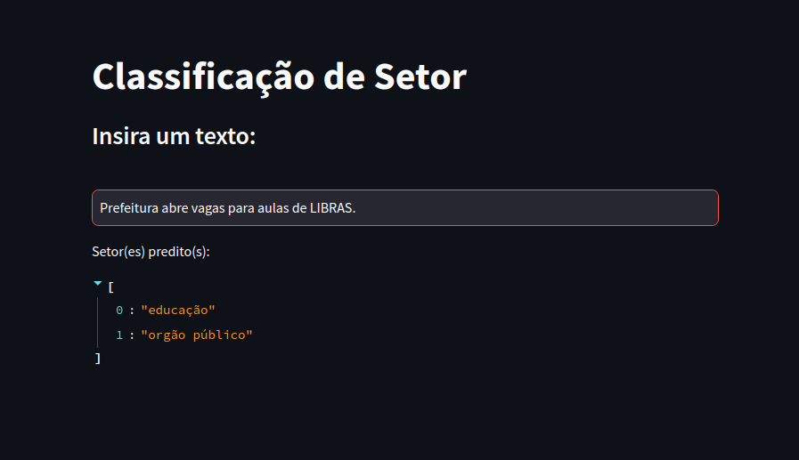

# sectors



### [Clique aqui](https://sectors-nlp.streamlit.app/) para classificar em qual setor seu texto se enquadra.

## Este é um projeto de Processamento de Linguagem Natural onde o interesse é, dado um texto de input, predizer se ele é referente à um ou mais setores dentre 5. 

**Os 5 setores são:**

```
1. Educação
2. Finanças
3. Indústrias
4. Órgão Público
5. Varejo
```

O Texto pode se enquadrar em um ou mais setores, como no exemplo "Prefeitura abre vagas para aulas de LIBRAS" onde o texto pode ser classificado em Órgão Público e Educação.

## Resumo:

O dataset utilizado possui a variável 'sentence' referente aos textos e a variável 'category' referente aos setores de interesse. Os textos estão disponíveis em português com as respectivas acentuações das palavras, com isso foi necessário realizar todo o pre processamento, que envolve desde a remoção de caracteres especiais até o padding (vide `analysis.ipynb`). Para o problema de multi label, foi decidido criar uma arquitetura de Rede Convolucional para as labels binarizadas, ou seja, foi utilizado a função de ativação sigmóide na última camada densa, onde o peso entre 0 e 1 atribuído à cada classe é comparado à um threshold. Se uma ou mais classe ultrapassar esse threshold, o output será de que o texto é referente à esses setores. 

Para mais informações sobre a abordagem [Large-scale multi-label text classification](https://keras.io/examples/nlp/multi_label_classification/)    

## Dataset:
  
- O dataset consiste em uma coluna `sentence`, referente aos textos a serem analisados, e a coluna `category` que contém os setores para o respectivo texto, podendo ser apenas um ou mais setores.

## Conteúdo:

**No repositório podem ser encontrados os arquivos:**
- `analysis.ipynb` - > Este notebook contém todo o pipeline da resolução do projeto, executado etapa por etapa.
- `NLPPipeline.py` -> Neste arquivo, é construída uma classe para execução do Pipeline de NLP (você pode passar seus próprio dataset).
- `run_pipeline.py` -> Este é um arquivo que exemplifica o uso da classe NLPPipeline.
- `PredictText.py` -> Este é um arquivo que executa a classificação a partir de um texto de input.
- `NLPStreamlit.py` -> Esse arquivo constrói uma aplicação simples em Streamlit, onde o usuário passa uma frase e é retornada a classe do texto (ou classes).
- `model_tensorflowjs` -> Nesta pasta está o modelo convertido para java script (feito utilizando o tensorflowjs).
- `CNN_MultiLabel_NLP.h5` -> Este é o modelo serializado, útil para fazer o load caso não queira executar o treinamento.
- `dataset` -> Nesta pasta está o dataset utilizado para o projeto.
- `images` -> É uma pasta auxiliar para armazenar imagens do projeto.
- `requirements.txt` -> Dependências.

## Uso:

**Passos iniciais**
1. Clone este repositório para o seu computador.
   ```
   git clone https://github.com/MatheussAlvess/<nome_do_repositório>.git
   ```
3. Navegue até o diretório do projeto.
4. Garanta ter as dependências necessárias (vide `requirements.txt`)
   
- **Para realizar a classificação de um texto, execute o comando no terminal:**

  ```
  python PredictText.py <texto_de_interesse>
  ```
 Com isso, será retornado o setor (ou setores) a qual o texto fornecido se enquadra.
  
  > Ex.: Executando `python PredictText.py Estude LIBRAS` será retornado `educação`, concluindo que o texto de input se enquadra nesse setor.

## Para converter seu modelo desenvolvido em python (Tensorflow/keras) para JavaScript, siga as etapas:
1. Instale o TensorFlow.js, com o comando no terminal:
   ```
   pip install tensorflowjs
   ``` 
2. Com TensorFlow.js instalado, execute no terminal 
   ```
   tensorflowjs_converter --input_format==keras model_saved/CNN_MultiLabel_NLP.h5 model_converted/ 
   ```
Assim seu modelo será convertido.

> [!TIP]
> Você pode salvar diretamente dentro do código, após ter o modelo treinado.
> 
>  ```
>  Exemplo:
>  
>  model = DCNN(vocab_size=2000)  
>  ...
>  model.compile(...)
>  model.fit(...)
>  tfjs.converters.save_keras_model(model, 'model_converted/')
>  ```

  

___________________________________________
## Para utilizar o pipeline como base para um projeto próprio, realize as seguinte etapas:

**Uma vez que tudo esteja pronto para ser executado (repositório clonado):**

1. Armazene seu dataset no formato `.csv` dentro de uma pasta.
   Ex.: `path_data_setimentos/dataset_sentimentos.csv`

2. Dentro do arquivo `run_pipeline.py`, altere o dicionário de parâmetros passando os diretórios, nomes e parâmetros do modelo da forma como achar mais adequada.
 Ex.:
  ```
  params = {
    'dataset_path': 'path_data_setimentos/',
    'dataset_name': 'dataset_sentimentos.csv',
    'sentences_variable': 'tweets',
    'categories_variable': 'sentimentos',
    'model_name': 'CNN_model_sentimentos.keras',
    'save': True, # necessário para o modelo ser salvo
    'emb_dim': 128,
    'nb_filters': 100,
    'ffn_units': 512,
    'nb_classes': 5,
    'batch_size': 32,
    'dropout_rate': 0.2,
    'nb_epochs': 100,
    'verbose': 1}
  ```

3. Uma vez com todos parâmetros de acordo, execute o comando no terminal:
   ```
   python run_pipeline.py
   ```
   Ao final da execução, será salvo o modelo nomeado conforme o especificado no dicionário `params`.
   Com o modelo salvo, é possível realizar as classificações dado um texto de input de interesse. 

4. Com isso, já pode ser utilizado o arquivo `PredictText.py` (se atentando em mudar o nome do modelo dentro do arquivo).

___________________________________________

# Explicando resolução do projeto:

**1. O primeiro passo foi decidir qual abordagem seria utilizada.**
- Optando pelo caminho da classificação Multilabel, foi decido criar uma arquitetura de Rede Convolucional.
- Para o modelo, foi idealizado o uso da função de ativação sigmóide na camada de saída, dado que as labels seriam representadas por um encoding binário.

**2. Análise Exploratória**.
- Uma vez decidido a modelagem, foi necessário fazer uma exploratória dos dados (esta etapa foi tratada da forma mais simples e 'eficiente' possível em busca de brevidade).
- A partir da análise, foi entendido que os textos de input para o modelo se tratavam de frases na língua portuguesa com acentos, números e caracteres especiais.

**3. Tratamento dos dados**.
- Com isso em mente, iniciou-se a preparação dos dados para input no modelo.
- O primeiro passo para o tratamento desses textos, foi a remoção de acentos e caracteres especiais, feito com auxilio de funções em python como (Regular Expression e String).
- Posteriormente, foram removidas as _StopWords_ em busca de diminuir a dimensionalidade do input do modelo.
 (Adendo: Etapas de lemantização, normalização, tokens especiais, etc., não foram consideradas nessa versão do projeto.)

**4. Preparação dos dados**.
- Considerando o tratamento realizado, a próxima etapa foi a conversão dos caracteres para números.
- Nessa etapa, foi realizada a tokenização dos textos utilizando a biblioteca Tensorflow/Keras (que por si só já considera uma tratativa dos textos de forma mais simplista).
- Seguido da tokenização, foi feito o padding dos vetores de tokens para garantir que todos inputs tenham o mesmo tamanho (novamente utilizando Tensorflow/Keras).

Nesse momento, já era possível passar os dados de input para o modelo, no entando, é preciso criar o modelo e fazer a divisão dos conjuntos de treino e teste.

**5. Divisão dos conjuntos de treino e teste.**
- Antes de realizar a divisão, foi feito o encoding das labels para uma representação binária.
- Uma vez com os textos na estrutura de input do modelo e as labels codificadas, foi aplicada a divisão utilizando scikit-learn reservando 10% dos dados para utilizar como teste e garantindo que a distribuição das classes nos dados de treino e teste seja semelhante à distribuição original dos dados (argumento stratify).

**6. Criando o modelo CNN.**
- Para a construção da arquitetura CNN, foram testadas algumas configurações de quantidade de camadas de convolução e tamanho de filtros. No fim, ficamos com um total de 5 convoluções (1 bigram, 2 trigrams e 2 fourgrams)
- Ressaltando que após as convoluções, a camada flatten é processada pela camada densa que tem como função de ativação da última camada a sigmóide.

**7. Avaliação do modelo.**
- Com o modelo criado e os dados preparados, foi iniciado o treinamento considerando alguns hiperparâmetros predefinidos (os quais não foram otimizados, mas vale um tunning em busca de melhores resultados).**
- O modelo foi treinado com 100 épocas e durante o treinamento pôde ser observado um comportamento levemente ascendente da loss, indicando um possível overfitting (válido considerar regularizações e até mesmo um early stop).
- O desempenho da acuária durante o treinamento foi aceitável, no entanto, após atingir um certo ponto fica constante, sendo mais um indicativo de overfitting, onde o modelo em algum momento não consegue generalizar.
- No período de teste, o modelo apresentou uma acurácia interessante de aproximadamente 71%.

**8. Predição de novos textos.**
- Como última etapa, foram realizadas algumas predições com textos personalizados com a finalidade de entender a eficiência do modelo.
- No geral, é um bom classificador com margem para melhorias.


